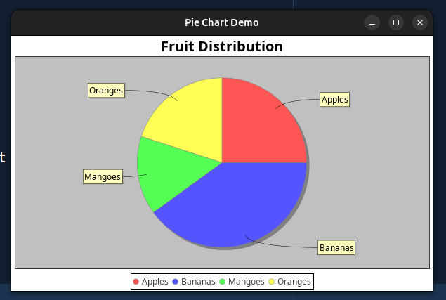

# 📊 CustomPieChart Java Component

A reusable Java Swing component that displays a pie chart using **JFreeChart**. This class allows you to easily generate pie charts anywhere in your application by passing a data map and a chart title.

---

## ✅ Features

- 📦 Easy to plug into any Swing UI (`JPanel`)
- ♻️ Reusable — no need to rewrite chart logic for each use
- 🧠 Accepts dynamic data via `Map<String, Double>`
- 🎯 Built on the popular [JFreeChart](https://sourceforge.net/projects/jfreechart/) library

---

## 📁 Files

- `CustomPieChart.java` - The reusable class for generating pie charts
- `PieChartDemo.java` - A sample file showing how to use the chart

---

## 🛠 Requirements

- Java 8 or above
- JFreeChart library:
  - `jfreechart-x.x.x.jar`
  - `jcommon-x.x.x.jar`

> 📥 [Download JFreeChart](https://sourceforge.net/projects/jfreechart/)

---

## 🧪 How to Use

### 1. Add the `CustomPieChart.java` class to your project.

```java
import java.util.Map;

CustomPieChart chart = new CustomPieChart("Chart Title", yourMapData);
JPanel chartPanel = chart.getChartPanel();
yourContainerPanel.add(chartPanel);
### 2. Pass a map with your data:
```java
Map<String, Double> data = new HashMap<>();
data.put("January", 1200.0);
data.put("February", 900.0);
data.put("March", 1500.0);

📌 Example
```java
Map<String, Double> fruits = new HashMap<>();
myData.put("Apples", 25.0);
myData.put("Oranges", 20.0);
myData.put("Bananas", 40.0);
myData.put("Mangoes", 15.0);
CustomPieChart pie = new CustomPieChart("Fruit Distribution", fruits);
JPanel chartPanel = pie.getChartPanel();

myMainPanel.add(chartPanel);


### 📷 Screenshot


📄 License
This project is open for educational and personal use. JFreeChart is under LGPL.

🙋‍♂️ Author
Elisha – IT Student & Java Developer
📫 Contact: [your-email@example.com]
🌍 Projects: Web | Desktop | Data Visualization